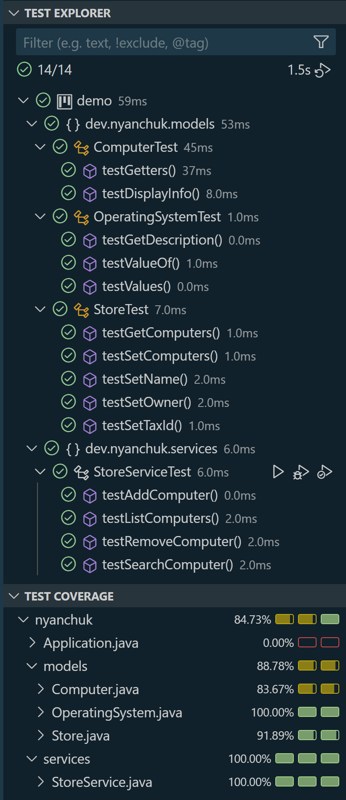
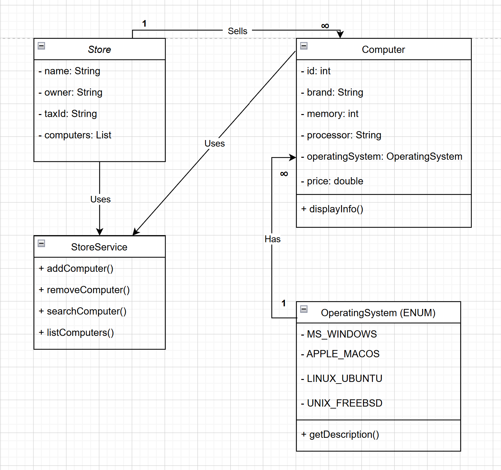

# Computers Shop

This project models a computer shop with various operations such as adding, removing, searching, and listing computers. The main goal is to implement a Java application that simulates a computer store with methods to manage its inventory.

## Project Description

The computer shop has the following attributes:
- **Store Name**: The name of the store.
- **Owner**: The owner of the store.
- **Tax ID**: The unique tax identification number for the store.

Each computer in the shop has the following attributes:
- **Id**: Unique computer identifier.
- **Brand**: The brand of the computer.
- **Memory**: The memory (RAM) of the computer in gigabytes.
- **Processor**: The processor details of the computer.
- **Operating System**: The operating system installed on the computer.
- **Price**: The price of the computer.

### Functional Requirements:
The program must have methods to:
1. Add a computer to the store.
2. Remove a computer from the store by its brand.
3. Search for a computer in the store by its brand.
4. List information of all the computers in the store.

### Additional Requirements:
- **UML Class Diagram**: A class diagram should be provided to illustrate the relationships and structure of the program.
- **Unit Tests**: Unit tests are required with a minimum code coverage of 70%.

## Key Classes:
- **Computer**: Represents a computer with attributes like brand, memory, processor, operating system, and price.
- **Store**: Represents the store itself with attributes like name, owner, tax ID, and a list of computers.
- **OperatingSystem Enum**: Enum for different operating systems like Windows, macOS, Ubuntu, etc.
- **StoreService**: Contains business logic for adding, removing, searching, and listing computers in the store.

## How to Run
1. Clone the repository:
    ```bash
    git clone https://github.com/NelliYanchuk/java-computer-shop.git
    ```

2. Navigate to the project directory:
    ```bash
    cd java-computer-shop
    ```

3. Compile and run the project using your preferred Java IDE or the command line:
    ```bash
    javac src/dev/nyanchuk/*.java
    java dev.nyanchuk.Main
    ```

4. To run tests, use JUnit with your preferred testing tool:
    ```bash
    java -cp .:junit.jar org.junit.runner.JUnitCore dev.nyanchuk.services.StoreServiceTest
    ```

## Example Usage
```java
// Create a store and some computers
Store store = new Store("Tech Shop", "John Doe", "123456789");
Computer dellComputer = new Computer(1, "Dell", 16, "Intel i7", OperatingSystem.MS_WINDOWS, 1200);
Computer appleComputer = new Computer(2, "Apple", 8, "M1", OperatingSystem.APPLE_MACOS, 1500);

// Add computers to the store
StoreService storeService = new StoreService();
storeService.addComputer(store, dellComputer);
storeService.addComputer(store, appleComputer);

// List all computers in the store
storeService.listComputers(store);

// Search for a computer by brand
Computer searchedComputer = storeService.searchComputer(store, "Apple");
System.out.println("Found: " + searchedComputer.getBrand());

// Remove a computer by brand
storeService.removeComputer(store, "Dell");
```

## Testing

The project uses **JUnit 5** for unit tests.

### Running Tests

To run the tests, use the following Maven command:

    mvn test


### Test Coverage



## Diagrams
- **Class Diagram**:




## Contact me with:
**Nelli Yanchuk** [GitHub](https://github.com/NelliYanchuk) / [LinkedIn](https://www.linkedin.com/in/nelli-yanchuk-a24b81138/)